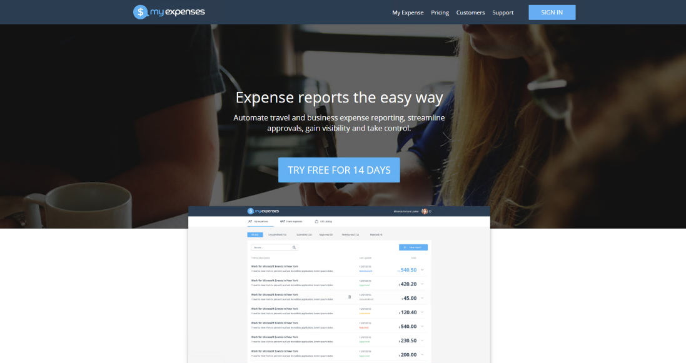
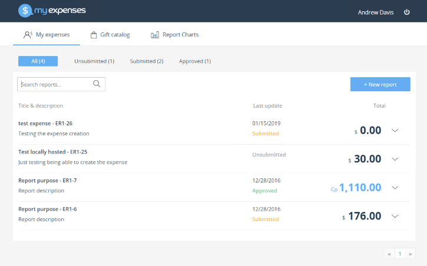
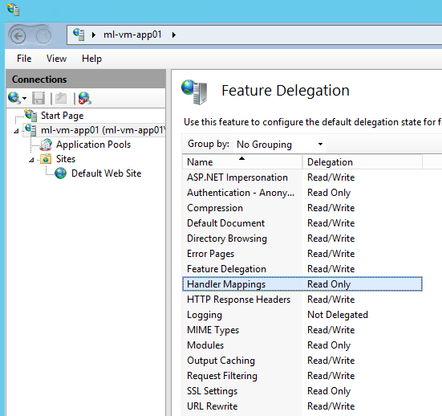
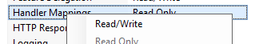

# MyExpenses app

Solution for the MyExpenses app. Based on the original project: [https://github.com/Microsoft/developer-immersion-data](https://github.com/Microsoft/developer-immersion-data)

## App Usage

Two users can be used for authentication. Note the directory being used is managed by the HOL immersive experience team.
Normal user: - Andrew.Davis@holexperiences.onmicrosoft.com - P2ssw0rd@User
Manager user: - Robin.Count@holexperiences.onmicrosoft.com - P2ssw0rd@User

To access the app hosted in IIS: [http://localhost](http://localhost/#/)
To access when debugging with npm start: [http://localhost:8000/#/](http://localhost:8000/#/)

## Installation / Setup

### nodejs

1. Install NodeJS [https://nodejs.org/download/](https://nodejs.org/download/) -> [https://nodejs.org/dist/v10.15.0/node-v10.15.0-x64.msi](https://nodejs.org/dist/v10.15.0/node-v10.15.0-x64.msi)

### iis

1. Add IIS feature to your server
1. Set _*{Server Name} > Feature Delegation > Handler Mappings*_ to *Read/Write*

    
    

1. Set Read/Write permissions on C:\inetpub\wwwroot
1. Install the iisnode module [https://github.com/Azure/iisnode/releases](https://github.com/Azure/iisnode/releases) -> [https://github.com/Azure/iisnode/releases/download/v0.2.26/iisnode-full-v0.2.26-x64.msi](https://github.com/Azure/iisnode/releases/download/v0.2.26/iisnode-full-v0.2.26-x64.msi)
1. 

### Web Content

1. Copy this project to C:\inetpub\wwwroot
1. Open a console, navigate to _*C:\inetpub\wwwroot*_, and run *npm install*

Reference material: [https://hostek.com/blog/node-js-applications-on-windows-iis/](https://hostek.com/blog/node-js-applications-on-windows-iis/)
[https://wiki.hostek.com/Node.js_on_Windows](https://wiki.hostek.com/Node.js_on_Windows)

